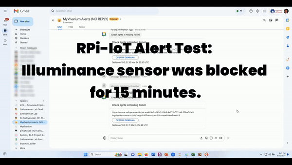

# RPi-IoT for MyVivarium

A stand-alone Raspberry Pi-enabled IoT system to monitor near-realtime sensor data in a MyVivarium web app. This system can also be used on its own to monitor near-realtime sensor data.

Demo interactive snapshot: **[Link](https://snapshots.raintank.io/dashboard/snapshot/BS9oMWCz8rpT2H3xoGVoHyDHSobyJrrW)**

## Features
- Powered by Raspberry Pi
- Multiple I2C sensors
- Data visualization using Grafana
- Event alerts via Google chat webhook app

Visit our **[wiki](https://github.com/myvivarium/RPi-IoT/wiki)** to get started!
